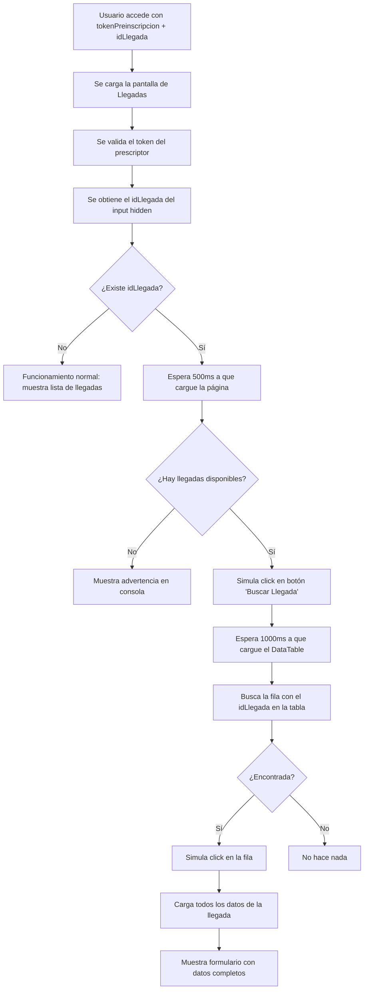

# Acceso Directo a Llegadas Específicas

## 📝 Ejemplo Rápido

Para acceder directamente a una llegada específica desde cualquier pantalla externa, utiliza este formato de URL:

```
/view/Llegadas/?tokenPreinscripcion=gatzq11cgec8e152e61a66d67f006&idLlegada=45
```

**Resultado:** La pantalla de Llegadas se abrirá y automáticamente cargará y mostrará los datos completos de la llegada con ID `45`.

---

## 🎯 Descripción

Esta funcionalidad permite crear enlaces directos a llegadas específicas, evitando que el usuario tenga que:
1. Abrir la pantalla de Llegadas
2. Buscar en la lista de llegadas
3. Hacer click manualmente en la llegada deseada

El sistema automáticamente localiza y carga la llegada especificada en el parámetro `idLlegada`.

---

## 📋 Parámetros de la URL

### Parámetros Obligatorios

| Parámetro | Tipo | Descripción | Ejemplo |
|-----------|------|-------------|---------|
| `tokenPreinscripcion` | String | Token único del prescriptor (interesado). Se obtiene de la tabla `tm_prescriptores` | `gatzq11cgec8e152e61a66d67f006` |
| `idLlegada` | Integer | ID único de la llegada. Se obtiene del campo `id_llegada` de la tabla correspondiente | `45` |

### ⚠️ Importante
- Ambos parámetros son **obligatorios** para el acceso directo
- El `tokenPreinscripcion` valida el acceso al prescriptor
- El `idLlegada` identifica la llegada específica a cargar

---

## 🔧 Casos de Uso

### 1. Desde la Pantalla de Perfil

```javascript
// Ejemplo en JavaScript
const token = data[0]["tokenPrescriptores"];
const idLlegada = data[0]["id_llegada"];
const urlDirecta = `../../view/Llegadas/?tokenPreinscripcion=${token}&idLlegada=${idLlegada}`;

$('#btnVerLlegada').attr('href', urlDirecta);
```

### 2. Desde un Listado de Alojamientos

```php
// Ejemplo en PHP
$token = $row["tokenPrescriptores"];
$idLlegada = $row["id_llegada"];
$urlDirecta = "../Llegadas/?tokenPreinscripcion={$token}&idLlegada={$idLlegada}";

echo "<a href='{$urlDirecta}' target='_blank' class='btn btn-primary'>Ver Llegada</a>";
```

### 3. Desde un Email o Notificación

```
https://tudominio.com/view/Llegadas/?tokenPreinscripcion=abc123xyz&idLlegada=78
```

---

## 🔄 Flujo de Funcionamiento



---

## 💻 Implementación Técnica

### Archivos Modificados

1. **`view/Llegadas/index.php`** (línea 22-24)
   ```php
   // Capturar parámetro opcional idLlegada para enlace directo
   $idLlegadaDirecta = isset($_GET["idLlegada"]) ? intval($_GET["idLlegada"]) : null;
   ```

2. **`view/Llegadas/index.php`** (línea 459)
   ```php
   <input type="hidden" id="idLlegadaDirecta" value="<?php echo $idLlegadaDirecta ?? ''; ?>">
   ```

3. **`view/Llegadas/index.js`** (línea 2864+)
   - Se agregó un nuevo `$(document).ready()` al final del archivo
   - Detecta el valor del input `#idLlegadaDirecta`
   - Si existe, ejecuta la secuencia de carga automática

---

## ✅ Compatibilidad

### 100% Retrocompatible

La funcionalidad **NO afecta** el comportamiento actual:

| Escenario | Comportamiento |
|-----------|----------------|
| Solo `tokenPreinscripcion` | ✅ Funciona igual que antes: muestra lista de llegadas |
| `tokenPreinscripcion` + `idLlegada` | ✅ Nuevo: carga directamente la llegada especificada |
| Enlaces existentes | ✅ Siguen funcionando sin modificaciones |

### Enlaces No Modificados

Los siguientes enlaces existentes continúan funcionando igual:

- `view/Perfil/index.php` → Botón "Ver Llegada"
- `view/Listado_Preinscripcion/index.php` → Enlaces a llegadas
- `view/Listado_Alojamientos/index.php` → Enlaces a llegadas

---

## 🕐 Tiempos de Espera

El sistema utiliza dos `setTimeout` para garantizar que los elementos estén cargados:

| Timeout | Duración | Propósito |
|---------|----------|-----------|
| Primer timeout | 500ms | Espera a que la página y el DOM estén completamente cargados |
| Segundo timeout | 1000ms | Espera a que el DataTable de llegadas esté inicializado |

**Nota:** Estos tiempos pueden ajustarse si se experimenta lentitud en la carga.

---

## 🐛 Debugging

### Console Logs

El sistema incluye mensajes de consola para facilitar el debugging:

```javascript
console.log('Cargando llegada directa con ID:', idLlegadaDirecta);
console.log('Llegada encontrada, abriendo...');
console.warn('No hay llegadas disponibles para este prescriptor');
```

### Verificación Manual

Para verificar que funciona correctamente:

1. Abre la consola del navegador (F12)
2. Accede con la URL completa: `/view/Llegadas/?tokenPreinscripcion=[TOKEN]&idLlegada=[ID]`
3. Observa los mensajes en la consola
4. Verifica que se abre automáticamente la llegada correcta

---

## 🔒 Consideraciones de Seguridad

### Sin Validación Backend

⚠️ **Actualmente NO se valida** que el `idLlegada` pertenezca al prescriptor del token.

**Recomendación futura:** Implementar validación en el controlador `controller/llegadas.php`:

```php
// Pseudo-código para futura implementación
case "recogerLledagasXIdLlegada":
    $idLlegadas = $_POST["idLlegadas"];
    $idPrescriptor = $_SESSION["idPrescriptor"]; // O del token
    
    // Validar que la llegada pertenece al prescriptor
    if (!$llegada->perteneceAPrescriptor($idLlegadas, $idPrescriptor)) {
        echo json_encode(["error" => "Acceso no autorizado"]);
        exit;
    }
    
    $datos = $llegada->recogerLlegadasXID($idLlegadas);
    echo json_encode($datos);
    break;
```

---

## 📅 Información de Cambios

- **Fecha de implementación:** 10 de enero de 2026
- **Rama:** `listados_llegadas`
- **Archivos modificados:** 
  - `view/Llegadas/index.php`
  - `view/Llegadas/index.js`
- **Retrocompatibilidad:** ✅ 100%

---

## 📞 Soporte

Para cualquier problema o mejora relacionada con esta funcionalidad, contactar al equipo de desarrollo.
